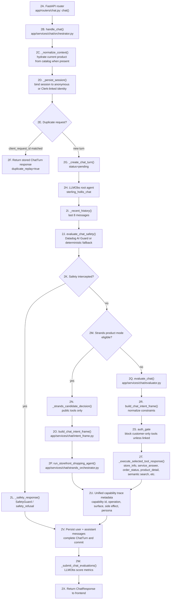
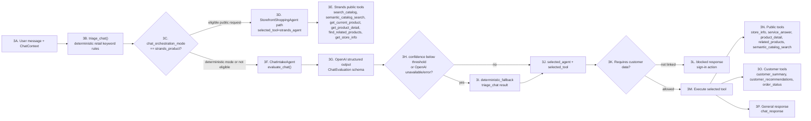
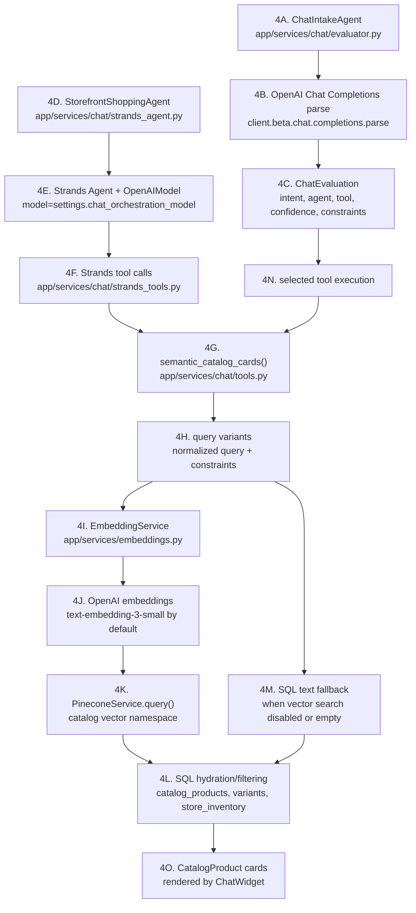
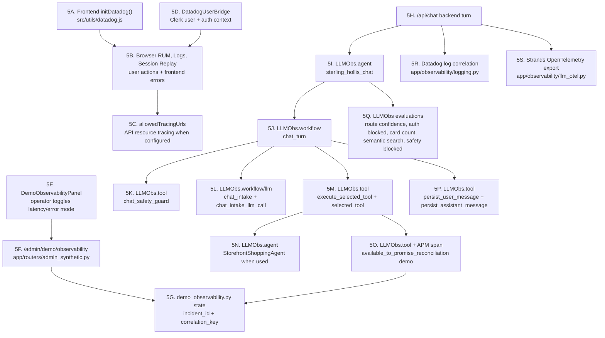

# Sterling Hollis Chat, OpenAI, and Observability Map

This is a presentation-oriented map of how the storefront chat request moves from the React UI, through the FastAPI backend capability registry, into OpenAI-backed routing and catalog tools, and out to Datadog/API trace observability. The labels on boxes use a short reference code so the diagrams can be discussed verbally in a slide deck.

Authoritative backend contract sources:

- `quickstarkdemo/sterling-hollis-be/docs/capability-map.md`
- `quickstarkdemo/sterling-hollis-be/docs/openapi.json`
- frontend manifest: `src/contracts/backendCapabilityManifest.json`

The frontend manifest is refreshed with `npm run refresh:api-contract` and keeps the OpenAPI `x-sterling-*` capability metadata used by the API client drift tests.

Storefront voice uses `GET /api/chat/realtime/capability`, `POST /api/chat/realtime/sessions`, and `POST /api/chat/realtime/tool-calls`. The browser only exposes compact lifecycle events plus bounded visible user and assistant transcript turns to the trace projection. It does not place raw audio, SDP offers or answers, provider payloads, or ephemeral Realtime credentials into the trace UI.

## Unified Capability Vocabulary

| Surface | Frontend entry point | Backend capability surface | Notes |
| --- | --- | --- | --- |
| Storefront chat | `src/components/ChatWidget.jsx` | `public_shopper` / `shopper.chat.turn` | Text and consumer voice turns share the shopper chat response renderer. Capability diagnostics are hidden unless diagnostics mode is enabled. |
| Catalog Studio assistant | `src/components/admin/CatalogGlobalAssistant.jsx` | `catalog_admin` | Text and read-only voice tools use current assistant/v3 capability routes. |
| Developer trace UI | `src/components/api-trace/*` | `developer_trace` | Trace inspector projects capability id, surface, and status from unified metadata. |
| Operator demo controls | `src/components/DemoObservabilityPanel.jsx` | `operator_compatibility` | Intentionally operator-scoped and not part of normal shopper/admin UI. |
| MCP / ChatGPT clients | backend-hosted MCP bundles | persona-scoped bundles | Public/shopper/catalog-admin/associate/executive bundles share the same registry with persona policy boundaries. Send-capable bundles require explicit approval policy. |

## Diagram 1: End-To-End Chat Request

```mermaid
flowchart LR
  FE1["1A. Page context<br/>src/pages/* + usePageChatContext"] --> FE2["1B. ChatContextProvider<br/>route, page_type, product, category, store_id"]
  FE2 --> FE3["1C. ChatWidget<br/>message, conversation_id, context"]
  FE4["1D. AuthTokenBridge<br/>Clerk bearer token when signed in"] --> FE5["1E. apiClient Axios interceptor"]
  FE3 --> FE5
  FE5 --> API["1F. POST /api/chat<br/>app/routers/chat.py"]

  API --> AUTH["1G. optional_chat_identity<br/>app/services/auth/clerk.py"]
  API --> DB1[("1H. Postgres session<br/>get_db()")]
  AUTH --> ORCH["1I. handle_chat<br/>app/services/chat/orchestrator.py"]
  DB1 --> ORCH

  ORCH --> PERSIST1[("1J. ChatSession + ChatTurn<br/>chat_sessions, chat_turns")]
  ORCH --> SAFETY["1K. Safety guard<br/>app/services/chat/safety.py"]
  SAFETY --> ROUTE["1L. Route and intent decision<br/>Strands candidate or ChatIntakeAgent"]
  ROUTE --> FRAME["1M. Intent frame<br/>normalized categories, genders, budget, product anchor"]
  FRAME --> EXEC["1N. Execute selected tool or StorefrontShoppingAgent"]

  EXEC --> DATA["1O. Catalog, customer, order, store data<br/>SQL + optional Pinecone"]
  EXEC --> OPENAI["1P. OpenAI components<br/>chat completion, Strands model, embeddings"]
  EXEC --> RESP["1Q. ChatResponse<br/>message, cards, actions, capability-aware tool_trace"]
  RESP --> PERSIST2[("1R. ChatMessage + ChatToolCall<br/>assistant response and tool outputs")]
  RESP --> FE3

  ORCH -. spans, tags, evals .-> DD["1S. Datadog LLMObs/APM"]
  FE3 -. RUM/logs/resource tracing .-> DDRUM["1T. Datadog Browser RUM + Logs"]
```

**What is happening:** the UI gathers page context before the user sends a message, then `ChatWidget` posts to `/api/chat`. The backend resolves optional Clerk identity, persists or resumes a chat session, creates an idempotent chat turn, evaluates safety, chooses the routing path through the shared capability model, executes one tool or agent path, persists the response and tool calls, and returns a `ChatResponse` containing the assistant message plus product cards/actions and capability-aware trace metadata. Datadog and API traces are wired on both sides: frontend RUM/logs in `src/utils/datadog.js`, frontend trace projection in `src/utils/apiTraceProjection.js`, and backend capability/LLMObs/APM spans in the backend services.

## Diagram 2: Backend Python Route Through A Chat Turn

**What is happening:** `handle_chat()` is the central Python function for a chat turn. It wraps the whole turn in Datadog LLMObs, then runs a structured sequence: normalize request context, load history, safety-check the message, choose an orchestration path, run the selected capability/tool or agent, annotate the trace with unified capability metadata, persist the final state, and submit evaluation scores.

## Diagram 3: Routing And Tool Selection

**What is happening:** deterministic `triage_chat()` always provides a fallback interpretation. In deterministic mode, `evaluate_chat()` may call OpenAI to produce a structured `ChatEvaluation`; if there is no API key, low confidence, or an error, it falls back to deterministic triage. In `strands_product` mode, selected public product/store requests can bypass the intake LLM and run through `StorefrontShoppingAgent` with public tools only. Customer-specific tools always pass through the auth gate.

## Diagram 4: OpenAI And Catalog Retrieval Components

**What is happening:** there are three main OpenAI-backed surfaces. First, the intake evaluator uses an OpenAI structured-output chat completion to choose the right agent/tool. Second, the optional Strands agent uses an OpenAI model to orchestrate public storefront tools. Third, semantic catalog search uses OpenAI embeddings, then Pinecone vector search, then SQL hydration and availability filtering. If embeddings or Pinecone are not configured, catalog search falls back to SQL text/category search.

## Diagram 5: Observability Wiring

**What is happening:** frontend Datadog captures browser-level user/session context, while the backend creates a nested LLMObs trace for each chat turn. The root span is `sterling_hollis_chat`; child spans identify safety, history, context normalization, intake routing, selected tool execution, persistence, and optional Strands agent activity. The demo observability harness injects a realistic latency/error span into the chat path with stable `incident_id` and `correlation_key` tags for presentation demos.

## Reference Key

| Ref | Component | Primary files |
| --- | --- | --- |
| 1A-1E | Frontend context, auth, and API client | `src/components/ChatContextProvider.jsx`, `src/components/ChatContext.jsx`, `src/components/ChatWidget.jsx`, `src/components/AuthTokenBridge.jsx`, `src/utils/apiClient.js` |
| 1F-2B | FastAPI chat entrypoint | `app/routers/chat.py`, `app/services/chat/orchestrator.py` |
| 1G | Optional Clerk identity | `app/services/auth/clerk.py` |
| 2C-2G | Session, idempotency, and persistence setup | `app/services/chat/orchestrator.py`, `app/models.py` |
| 2J-2L | Safety handling | `app/services/chat/safety.py`, `app/services/chat/orchestrator.py` |
| 3A-3P | Routing, auth gate, and tool choice | `app/services/chat/triage.py`, `app/services/chat/evaluator.py`, `app/services/chat/intent_frame.py`, `app/services/chat/orchestrator.py` |
| 4A-4C | OpenAI structured route evaluator | `app/services/chat/evaluator.py`, `app/services/chat/agents.py` |
| 4D-4F | Strands storefront agent | `app/services/chat/strands_agent.py`, `app/services/chat/strands_orchestrator.py`, `app/services/chat/strands_tools.py` |
| 4G-4O | Catalog, embeddings, Pinecone, SQL fallback | `app/services/chat/tools.py`, `app/services/embeddings.py`, `app/services/pinecone_service.py`, `app/catalog/service.py` |
| 5A-5D | Frontend Datadog | `src/utils/datadog.js`, `src/components/DatadogUserBridge.jsx` |
| 5H-5Q | Backend LLMObs spans and evaluations | `app/services/chat/orchestrator.py`, `app/services/chat/evaluator.py`, `app/services/chat/strands_orchestrator.py`, `app/services/chat/tools.py` |
| 5E-5G, 5O | Demo observability harness | `src/components/DemoObservabilityPanel.jsx`, `app/routers/admin_synthetic.py`, `app/services/demo_observability.py` |
| 5R-5S | Backend log/OTel export setup | `app/observability/logging.py`, `app/observability/llm_otel.py`, `app/observability/genai_otel.py` |

## Slide Narrative

1. The frontend owns shopper context. Each page registers the current route, store, category, and product context. The chat drawer sends that context plus the user message to `/api/chat`.
2. The backend owns trust and persistence. It resolves Clerk identity if a bearer token is present, creates or reuses a chat session, detects duplicate/retry turns, and persists every user and assistant message.
3. The backend evaluates safety before routing. Datadog AI Guard is used when configured; otherwise the code can use a deterministic demo fallback or allow the request depending on environment.
4. Routing has a fallback-first design. Deterministic `triage_chat()` always provides a usable decision. OpenAI structured output improves routing when configured, but low confidence or failures fall back to deterministic routing.
5. Product discovery has layered retrieval. Semantic search tries OpenAI embeddings plus Pinecone first, then falls back to SQL text/category browsing, and finally hydrates product cards from the database with store availability filters.
6. Observability is built into the path rather than added outside it. Each meaningful stage has LLMObs span metadata, tool inputs/outputs are annotated, final evaluations are submitted, and the demo harness can inject a tagged latency/error scenario for Datadog presentations.

## Practical Presentation Notes

- Use Diagram 1 as the executive overview.
- Use Diagram 2 when explaining the Python code path.
- Use Diagram 3 when discussing why a chat request becomes a specific tool call.
- Use Diagram 4 when the audience asks where OpenAI is actually used.
- Use Diagram 5 when the focus is Datadog, LLMObs, trace tags, and the demo fault harness.
