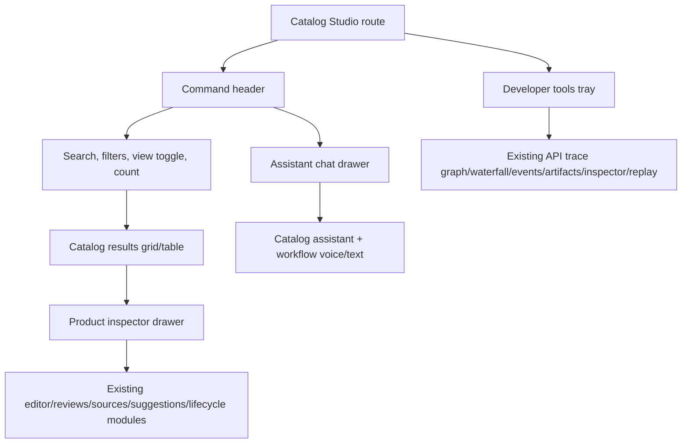

# feat: Refactor Catalog Studio into a chat-first command center

## Summary

Refactor Catalog Studio from a hero-led product-list plus tabbed workbench into a compact command center inspired by the Lovable `pixel-pilot-catalog` design and the attached standalone HTML. The new surface keeps Sterling Hollis visual tokens, keeps the current protected authoring workflow, and preserves the full sanitized API trace dock rather than replacing it with a shallow network panel.

---

## Problem Frame

The current Catalog Studio is functionally rich but visually heavy. Operators see a large marketing-style hero, a sticky product list, a framed workbench, a separate global assistant, nested tabs, and a persistent developer-tools launcher. The Lovable reference proves a simpler direction: a dense sticky header, search and filters as the primary catalog controls, an `Ask AI` chat drawer, product editing in a focused drawer, and developer tools as a bottom tray.

The refactor should borrow that workspace shape without copying the Lovable stack. This repository already uses Chakra, React Icons, Framer Motion, Sterling Hollis CSS variables, explicit product workflow state, and a full trace projection system. Those local contracts are more important than matching Tailwind class names or demo-only Lovable API behavior.

---

## Requirements

**Catalog Command Center**

- R1. Catalog Studio opens on a compact operator workspace with global search, filters, view toggle, `Ask AI`, `New product`, product count, and pagination visible without a separate hero band.
- R2. Product browsing supports the existing managed product API contracts, including v1 and v2 catalog listing paths, lifecycle state, category, brand, refresh, empty, loading, and error states.
- R3. Product selection opens a focused product inspector or drawer that keeps facts, media, pricing, inventory, reviews, sources, suggestions, and publication controls available without rebuilding the current tabbed page as-is.

**Chat-First Authoring**

- R4. `Ask AI` opens a chat-first assistant surface modeled after the customer chat drawer, with scoped prompts, message history, loading and error states, voice controls when configured, and cited read-only answers.
- R5. Draft creation and refinement remain version-bound, idempotent, moderation-aware, and recoverable when Responses, image generation, Realtime, review assistance, or supplier processing fail.
- R6. AI suggestions from text, voice, and supplier sources remain explicit review proposals; no assistant response mutates product data until an operator accepts a reviewable change.

**Developer Evidence**

- R7. Developer tools move toward the compact bottom-tray affordance of the Lovable reference while preserving the current API trace projection, including recent traces, graph, waterfall, events, artifacts, inspector, replay, sanitized copy, and export.
- R8. Developer evidence remains bounded to safe operational metadata and must not render credentials, prompts, raw source content, raw audio, private provider payloads, or chain-of-thought-like fields.

**Design and Verification**

- R9. The redesign uses existing Sterling Hollis tokens, radius scale, typography, button classes, and card restraint; it does not introduce Tailwind, shadcn, or a second design system.
- R10. The implementation includes responsive behavior for desktop and mobile, visible focus states, non-overlapping fixed surfaces, and screenshot verification against the Lovable/public reference direction.

---

## Key Technical Decisions

- **Adapt the Lovable composition, not its stack:** The reference uses Tailwind, Radix-like primitives, and demo server functions. The production refactor should keep Chakra components and existing CSS classes, borrowing layout and interaction patterns only.
- **Promote catalog controls into the page header:** Search, filters, product count, view mode, and top actions should replace the current large hero and left-only controls so the first viewport reads as a tool, not a landing page.
- **Use drawers for focused work:** The customer `ChatWidget` and Lovable assistant/product drawers show the right containment model for chat and product inspection. This reduces nested workbench chrome while keeping product editing and review modules intact.
- **Keep trace depth while changing the affordance:** The Lovable bottom developer tray is a good interaction cue, but the existing `ApiTraceDock` is the canonical evidence model. The UI can simplify entry, collapsed state, and responsive layout without narrowing trace content.
- **Issue boundaries mirror user-visible surfaces:** Each issue should be independently reviewable through tests and screenshots: shell, catalog grid/table, assistant drawer, product inspector, trace tray, and visual polish.

---

## High-Level Technical Design

The route should become a workspace coordinator. Catalog browsing, assistant chat, product inspection, and developer evidence should be peer surfaces controlled from the command center, while existing workflow modules continue owning their domain behavior.

---

## Scope Boundaries

### In Scope

- Redesign the Catalog Studio frontend surface around the public Lovable reference and the standalone HTML.
- Reuse or lightly reshape existing React components where possible.
- Preserve existing backend API contracts and safety semantics.
- Add or update frontend tests and visual verification for the changed surfaces.
- Close stale open issues and replace them with specific UI-refactor issues.

### Deferred to Follow-Up Work

- Backend endpoint redesign for catalog assistant or trace APIs.
- New product data model capabilities beyond what the current editor already exposes.
- Replacing Chakra with Tailwind or shadcn.
- Replacing the full API trace dock with the Lovable demo network logger.
- Exact pixel-perfect parity with Lovable after future design iterations.

---

## Implementation Units

### U1. Command Center Shell

- **Goal:** Replace the hero-led Catalog Studio layout with a compact sticky command center inspired by the Lovable header.
- **Requirements:** R1, R2, R9, R10.
- **Dependencies:** None.
- **Files:** `src/pages/CatalogStudioPage.jsx`, `src/pages/CatalogStudioPage.test.jsx`, `src/styles.css`.
- **Approach:** Move search, filters, product count, `Ask AI`, `New product`, and developer entry into the primary workspace chrome. Keep authorization, reference loading, dirty navigation guards, and developer lens state intact.
- **Patterns to follow:** `src/components/Shell.jsx`, `src/components/admin/CatalogProductList.jsx`, `src/components/ChatWidget.jsx`.
- **Test scenarios:** Authorized users see the compact command center without the old hero copy; anonymous users still see the protected sign-in state; dirty-product navigation confirmation still fires; v2 references still load once when capability advertises schema version 2.
- **Verification:** Desktop and mobile screenshots show a tool-first workspace with no hero band, no nested card-in-card layout, and no overlap with fixed chat or trace controls.

### U2. Catalog Results Grid and Table

- **Goal:** Refactor the managed product list into a main results surface with grid/table modes, search, filters, count, refresh, loading, empty, error, and pagination.
- **Requirements:** R1, R2, R9, R10.
- **Dependencies:** U1.
- **Files:** `src/components/admin/CatalogProductList.jsx`, `src/pages/CatalogStudioPage.jsx`, `src/pages/CatalogStudioPage.test.jsx`, `src/styles.css`.
- **Approach:** Keep existing list API selection logic while adding a Lovable-like grid/table presentation. Store view mode locally in component state or browser storage, but keep product selection and refresh behavior controlled by the route.
- **Patterns to follow:** Existing pagination and filter handling in `CatalogProductList`; product-card density from `src/components/ProductCard.jsx`.
- **Test scenarios:** Grid mode renders product cards with lifecycle/draft state; table mode renders the same product set with accessible row actions; search/filter changes reset pagination; refresh preserves filters; empty and error states remain reachable.
- **Verification:** Results remain scannable at 1440px, 1024px, and mobile widths.

### U3. Assistant Chat Drawer

- **Goal:** Replace the always-open global assistant panel with an `Ask AI` drawer modeled after the customer chat experience.
- **Requirements:** R4, R5, R6, R9, R10.
- **Dependencies:** U1.
- **Files:** `src/components/admin/CatalogGlobalAssistant.jsx`, `src/components/admin/ProductWorkbench.jsx`, `src/components/admin/ProductWorkbench.test.jsx`, `src/pages/CatalogStudioPage.integration.test.jsx`, `src/styles.css`.
- **Approach:** Convert the catalog assistant into a drawer or drawer-like panel with scoped starter prompts, catalog/product scope controls, cited answers, text composer, and Realtime controls. Keep read-only assistant answers distinct from draft-changing text and voice proposals.
- **Patterns to follow:** `src/components/ChatWidget.jsx` for drawer/thread/composer behavior; `VoiceControls` for Realtime session handling.
- **Test scenarios:** `Ask AI` opens and closes the drawer; catalog scope answers use `queryCatalogAssistant`; selected-product scope answers use local product context; voice read-mode returns a cited answer without product mutation; backend failure keeps product edits preserved.
- **Verification:** The drawer feels like the customer chat sibling, not a separate admin form.

### U4. Product Inspector Drawer

- **Goal:** Move product editing and review into a focused inspector opened from results, keeping existing editor modules intact.
- **Requirements:** R3, R5, R6, R9, R10.
- **Dependencies:** U1, U2.
- **Files:** `src/components/admin/ProductWorkbench.jsx`, `src/components/admin/ProductEditor.jsx`, `src/components/admin/ProductReviewPanel.jsx`, `src/components/admin/ProductSourceTray.jsx`, `src/components/admin/SuggestionReviewPanel.jsx`, `src/components/admin/ProductWorkbench.test.jsx`, `src/pages/CatalogStudioPage.integration.test.jsx`, `src/styles.css`.
- **Approach:** Use an inspector shell with compact tabs or segmented controls for product facts, reviews, supplier import, suggestions, chat, and legacy image controls. Preserve idempotency keys, recovery messages, stale suggestion guards, manual-edit locks, and publication handoff.
- **Patterns to follow:** Existing `ProductWorkbench` workflow orchestration; Lovable product detail drawer for containment and scan order.
- **Test scenarios:** Selecting a product opens inspector content; creating a new product opens draft assistant context; publishing still shows `View published product`; supplier handoff refreshes suggestions; review moderation still requires explicit reason; failures preserve the draft.
- **Verification:** The inspector avoids nested cards and keeps primary product details visible before lower-priority workflow history.

### U5. Developer Tools Tray and Trace Preservation

- **Goal:** Restyle developer tools around a compact bottom tray affordance while preserving the full trace visualizer.
- **Requirements:** R7, R8, R10.
- **Dependencies:** U1.
- **Files:** `src/pages/CatalogStudioPage.jsx`, `src/components/api-trace/ApiTraceDock.jsx`, `src/components/ApiTraceProvider.jsx`, `src/components/api-trace/ApiTraceDock.test.jsx`, `src/styles.css`.
- **Approach:** Align collapsed/expanded behavior with the Lovable bottom tray while keeping existing trace views and sanitized copy/export flows. Ensure the launcher does not collide with assistant and product drawers on desktop or mobile.
- **Patterns to follow:** Current `ApiTraceDock` preference persistence, keyboard behavior, and sanitized projection utilities.
- **Test scenarios:** Developer tray is hidden when unauthorized/unavailable; enabled tray opens with recent traces and all current view tabs; copy/export still sanitize payloads; collapsed state persists; fixed controls do not overlap the assistant drawer.
- **Verification:** Trace depth remains visibly richer than the Lovable demo network table.

### U6. Visual Polish, Responsive QA, and Demo Guide Update

- **Goal:** Apply the final CSS pass, screenshot verification, and presenter documentation updates.
- **Requirements:** R9, R10.
- **Dependencies:** U1, U2, U3, U4, U5.
- **Files:** `src/styles.css`, `docs/openai-catalog-studio-demo.md`, `src/pages/CatalogStudioPage.test.jsx`, `src/pages/CatalogStudioPage.integration.test.jsx`.
- **Approach:** Audit color balance, spacing, typography, focus rings, fixed-position surfaces, and copy. Update the presenter guide to describe the new command center, assistant drawer, product inspector, and developer trace tray.
- **Patterns to follow:** Existing Sterling Hollis CSS variables and customer chat responsive rules.
- **Test scenarios:** Page tests assert old hero/control copy is gone and new command center affordances exist; integration tests cover the same contract journey through the new surface labels; documentation references the new UI names.
- **Verification:** Run the focused Catalog Studio test suite, lint the changed source, build, and capture desktop/mobile screenshots.

---

## Risks & Dependencies

- **Risk:** Moving controls into drawers can hide safety-critical review states. **Mitigation:** Keep status, stale, dirty, and recovery messages in the inspector shell and preserve existing tests.
- **Risk:** Fixed assistant, product, and trace surfaces can overlap on mobile. **Mitigation:** Add explicit responsive rules and screenshot verification for collapsed and expanded states.
- **Risk:** Visual simplification can accidentally narrow developer evidence. **Mitigation:** Treat `ApiTraceDock` trace views as required content and refactor only launcher/tray layout.
- **Dependency:** Exact Lovable runtime behavior is demo-only; production behavior must continue using existing frontend/backend contracts.

---

## Sources & Research

- Public Lovable design: `https://pixel-pilot-catalog.lovable.app`
- Lovable project id: `646e8a28-70e7-404c-ad05-dea887144295`
- Standalone design export: `C:/Users/dirkn/Downloads/Catalog Studio (standalone).html`
- Existing product workflow guide: `docs/openai-catalog-studio-demo.md`
- Existing chat pattern: `src/components/ChatWidget.jsx`
- Existing Catalog Studio route and workflow: `src/pages/CatalogStudioPage.jsx`, `src/components/admin/ProductWorkbench.jsx`
- Existing trace model: `src/components/api-trace/ApiTraceDock.jsx`, `src/utils/apiTraceProjection.js`
